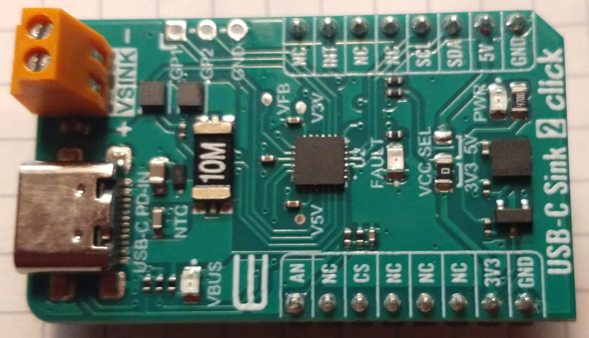

# AP33772
USB PD sink controller  
Abstraction class for Arduino systems

##### Table of Contants
- [description](#description)
- [interface](#interface)
    - [initialization](#initialization)
	- [configuration](#configuration)
	- [selcting profiles](#selcting.profiles)
	- [monitoring](#monitoring)
	
## description
The AP33772 class provides a simple interface to access the AP33772 chip.  
The AP33772 is a USB PD sink controller manufacture by [Diodes Incorporated](https://www.diodes.com/).  
It is a full featured easy to use all in one solution. It's features:
- built in protocol engine for requesting source capabilites and negotiating power
- built in current and voltage monitor
- programmable over voltage, over current and over temperature protection
- output to external power FET for switching the load
- I2C interface
- LED (fault) Indicator
- Interrupt line
unlike the FUSB302 form [ON Semiconductor](https://www.onsemi.com/) there is no need to implement 
the prtocol stack for power negotiation. For more details on FUSB 302 see 
[Ryan Ma's PD-Micro](https://github.com/ryan-ma/PD_Micro) or 
[Kai Clemens Liebich](https://github.com/kcl93/fusb302_arduino). They did a  great job!  
Tha AP33772 offers only PD3.0/PPS support with up to 100 W power. The chip is also available
as AP33772S wich operates different. While the AP33772 can set APDO with 20 mV and 50 mA increments
the AP33772S has only increments of 100 mV and 1 - 5 A in 16 steps = 250 mA but it can operate at up 
to 28 V and 150 W utilizing USB Power Delivery Specification Revision 3.1 EPR Profiles.

Ther is a demo board 
  
available from [MICROE](https://www.mikroe.com/) called ***usb-c-sink-2-click***.  

this class for Arduino will be left as is because the AP33772 is marked as **not reccomended for new design**.  

## interface
the interface is closely related to the register naming in the datasheet. Keep in mind that the device operates
with USB PD data objects such as Capabilies Messages, Power Data Objects, and Request Data Objects. These are all
32 bit blocks. See chapter 6.4.1 and 6.4.2 of the USB Power Delivery Specification Revision 3.1 for details.
For a detailed description of the operation of the chip see datasheet and EVKit manual at Diodes Inc.


```
void init(uint8_t int_pin);						// set int pin and do initial read

bool test_chip(void);							// check if AP33772 is present   
bool test_int_pin(void);						// check if int request has been set
	
uint8_t read_status(void);						// read status register
uint8_t get_last_status(void);					// get last status flags

uint8_t read_interrupt_mask(void);				// read interrupt mask register
void set_interrupt_mask(uint8_t int_mask);		// write interrupt mask register

void read_source_pdos(void);					// read advertised PDOs into buffer
uint8_t get_pdo_cnt(void);						// get number of advertised PDOs
uint32_t get_pdo(uint8_t pdo_num);				// get specific PDO, #0 ist used for last RDO

void set_rdo(uint32_t RDO);						// set RDO -> request pdo
uint32_t get_last_rdo(void);                    // get last requested data

uint16_t read_voltage_mV(void);					// read voltage register and return voltage in mV
uint16_t read_current_mA(void);					// read current register and return current in mA
int8_t read_temperature_C(void);				// read temperature register and return temperatur in °C

uint16_t get_voltage_measurement_mV(void);		// get voltage in mV from temp. storage 
uint16_t get_current_measurement_mA(void);		// get current in mA from temp. storage
int8_t get_temperature_measurement_C(void);		// get current in °C from temp. storage


uint16_t read_overcurrent_threshold_mA(void);			// read overcurrent threshold reg and convert to mA
uint8_t read_overtemperature_threshold(void);			// read overtemperatur setting for helath monitoring
uint8_t read_derating_temperature_threshold(void);		// read derating setting for health monitoring
uint16_t read_temperature_curve(temperature_et temp);	// read temperature curve of ntc

void set_overcurrent_threshold_mA(uint16_t mA);					// set overcurrent threshold
void set_overtemperature_threshold_C(uint8_t otp);				// set overtemperature threshold
void set_derating_temperature_threshold_C(uint8_t drtp);		// set derating threshold
void set_temperature_curve(temperature_et temp, uint16_t R);	// set temperature curve of ntc

void reset(void);								
```
# initialization
The init function needs to called with the digital pin used for the interrupt line.  
Note: this pin is polled, there is no interrupt handler attached

When done one could try the ***test_chip*** function to check if the chip is actually responding  

# configuration
The ***set_interrupt_mask*** function could be use to be alerted when any of the desired functions
is triggert. 
These are the options:  
```
DERATING_INT_FLAG			
OVERTEMPERATURE_INT_FLAG
OVERCURRENT_INT_FLAG		
OVERVOLTAGE_INT_FLAG		
NEWPDO_INT_FLAG			
SUCCES_INT_FLAG			
READY_INT_FLAG				
```
The ***status_flags_st*** bit type has to be used when the status is read.  

The temperature sensor has four calibration registers R25, R50, R75, R100.  They need to be programmed with 
the restance values in Ohms of the NTC at the corresponding temperatures 25, 50, 75, and 100 °C.  

If desired overvoltage, overcurrent overtemperature and derating temperature thresholds can be set.

# selcting profiles

when the basic configuration is then, status needs to be checked, when the source pdo's have been successflly
advertised the number of source capabilites and the profiles can be read.

|NEWPDO (B2)|SUCCESS (B1)|READY (B0)|Description|
|------|-------|-----|----------|
|   -  |   -   |  0  | Status is invalid |
|   0  |   0   |  1  | The host MCU had written the RDO register but the negotiation is unsuccessful |
|   0  |   1   |  1  | The host MCU had written the RDO register and the negotiation is successful |
|   1  |   0   |  1  | The PD source advertise PDOs and the negotiation with RDO is unsuccessful |
|   1  |   1   |  1  | The PD source advertise PDOs and the negotiation with RDO is successful |

 
Create the desired RDO and request ist.

When the negatiation has been succesful, the load switch will be turned on.

# monitoring
during operation the voltage, current and temperature can be monitored.


